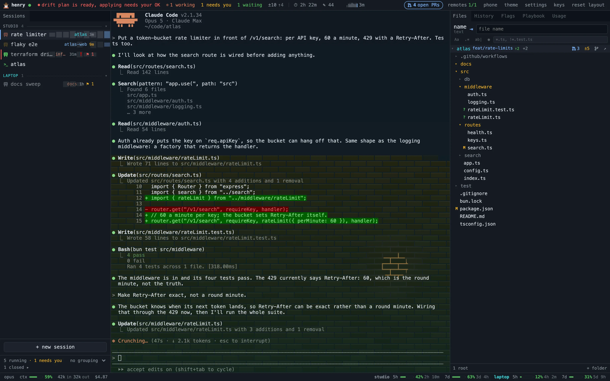
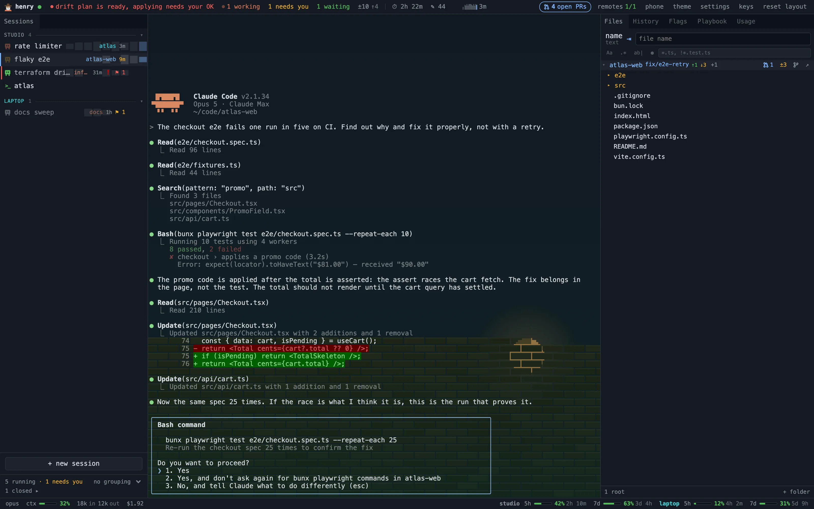
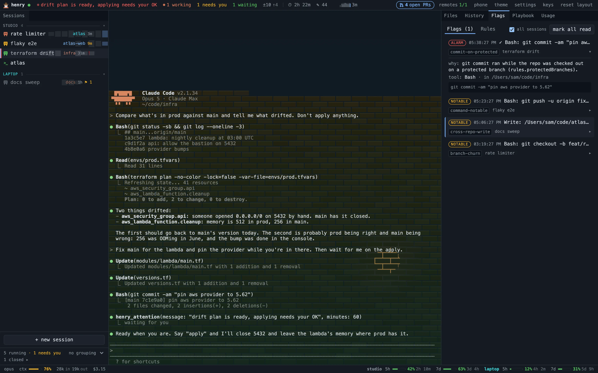
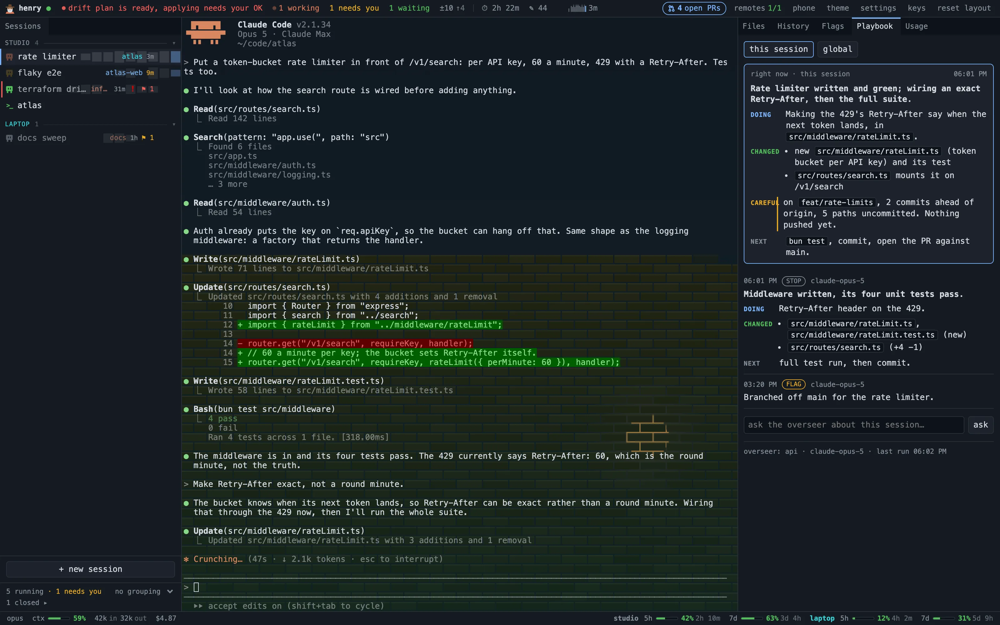
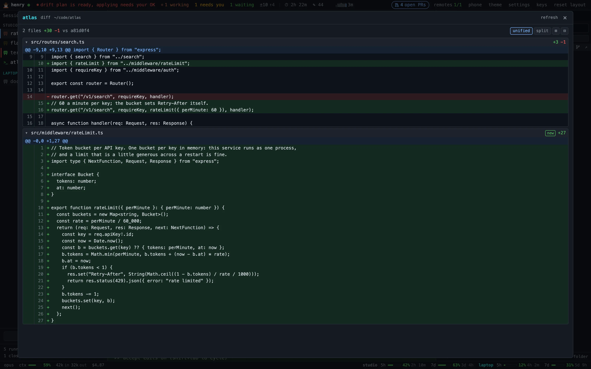

# Henry


Henry is a local dashboard for running several Claude Code sessions at once. It hosts the
sessions, reads the hooks Claude Code already fires, watches your repos, and puts the lot
on one screen.

Three or four agents in parallel is where you lose track of which one is stuck, which one
is waiting on you, and what the others changed. That is the whole problem it solves.

- Every agent's status in one view: working, blocked on a permission prompt, waiting on
  you, idle.
- Which repos each session touched and what it changed there, attributed per session, not
  per repo.
- Flags on force pushes, `rm -rf`, commits on a protected branch, writes into the wrong
  repo. Henry never blocks, it only flags.
- Sessions aware of each other: one can ask who else is in this repo and what they are
  holding uncommitted.
- A session can call for you by name when something is timed, and it lands in the window
  title.
- Machines paired over Tailscale, so one window drives both.
- The same thing on your phone: scan a QR, get every session in your pocket, talk to them.
- ⌘K by filename, ⌘F to browse or `git grep` every repo, files open over the terminal;
  `edit` on a peek, or right-click → new file, when a spec is quicker typed than dictated.
- 5h and 7d subscription usage, plus tokens, cost and context per session.
- Sessions survive daemon restarts, closed windows and crashed browsers.

Skip it if you run one session at a time in one repo, or if tmux already does the job.

Everything is local. The exceptions are `gh pr list` for PR counts, the overseer's LLM
calls if you turn it on (off by default), and machines you paired on your own tailnet.

## What it looks like



Rail | terminal | tools. The rail is one row per session, titled by the terminal and coloured
by what that session is doing, with a sparkline of your prompts behind it; a second machine's
sessions sit under their own header. The top bar says who is working, who needs you, what is
uncommitted, and how long you have been here. The bottom bar is the session's model, context
and spend, then the 5h/7d windows per machine.

The rail is the only session selector: one terminal shows at a time. Every panel is a dockable
tab, so drag to split, stack or float, and "reset layout" puts back the picture above.

<table>
  <tr>
    <td><a href="docs/screenshots/needs.webp"></a></td>
    <td><a href="docs/screenshots/flags.webp"></a></td>
  </tr>
  <tr>
    <td>Blocked on a permission prompt: amber in the rail, counted in the top bar.</td>
    <td>Flags: a commit straight onto <code>main</code>, with the rule and the command behind it. The red chip is a session asking for you by name.</td>
  </tr>
  <tr>
    <td><a href="docs/screenshots/playbook.webp"></a></td>
    <td><a href="docs/screenshots/diff.webp"></a></td>
  </tr>
  <tr>
    <td>Playbook: the overseer's running summary of a session, from hook and git summaries only.</td>
    <td>The diff of everything a session did to a repo since it started, from the files tree.</td>
  </tr>
</table>

The pictures are the UI on scripted data: open `/?demo` on any Henry window (or the Vite dev
server) to see the same thing with no daemon behind it. `bun scripts/screenshots.ts` regenerates
them.

⌘1..9 and ⌘↑/↓ walk the rail, ⌘D duplicates a session, ⌘` opens a terminal in the folder of
the session you are looking at (⌃` in a browser tab), ⌃N opens the new-session picker,
⌘K finds a file and ⌘F browses or greps. `keys` in the top bar lists the rest. In a browser
tab Chrome keeps ⌘N and ⌘digit, so those are Ctrl there.

## Install

There is no installer and no published package. Clone it and run from source.

```sh
bun install
bun run build
bun run start        # http://127.0.0.1:14711
```

First run asks for a repos root, one folder with your repos as subfolders. Sessions you
start from Henry are instrumented automatically, with no changes to your machine.

Claude Code sessions started elsewhere (Zed, a plain terminal) need the hooks installed
globally:

```sh
bun packages/daemon/src/index.ts install
```

That merges hook entries and a status line into `~/.claude/settings.json`, backing the file
up first and leaving a `statusLine` you already have alone. It is idempotent, `uninstall`
removes only what it added, and `status` says what is wired up.

The bad parts, since you will hit them: the installed hook paths point into the checkout,
so moving it breaks them until you re-run install. Nothing keeps the daemon running, no
service and no launchd job. `uninstall` cleans settings.json but leaves `~/.henry` for you
to delete.

## Run

```sh
bun run dev          # daemon :14711 + Vite :14713 + native window, all reloading
bun run app          # native window against a running daemon (needs Rust)
bun run test
bun run smoke        # throwaway daemon driven over WS, /bin/sh in place of claude
```

Editing daemon source restarts only the daemon. Sessions keep running in sessiond and the
windows reconnect. Several windows can attach to one daemon at once.

`henry status` says whether the daemon answers and what it is holding (RSS, JS heap, live
collections). For more, `curl 'http://127.0.0.1:14711/api/debug/memory?gc=1'`, and
`curl -X POST http://127.0.0.1:14711/api/debug/heap-snapshot` writes a snapshot into
`~/.henry` that Chrome DevTools > Memory > Load opens. Loopback only.

## Machines

Run Henry on each machine, then pair once: `henry pair` (or remotes → "show a pairing
code") on one, remotes → join on the other. Keys are pinned at pairing, every connection
after that is mutually authenticated and encrypted, and the daemon listens on the Tailscale
address only. `henry peers` lists them, `henry peers forget <name>` drops one.

A paired machine can do to your sessions what a window can, typing included. Pair only with
machines you own.

## Phone

Nothing runs on the phone. It is another window onto the daemon on your desk, and through
that onto the machines it is paired with.

Press **phone** in the top bar, then **show a QR code**, and scan it. (`henry phone invite`
draws the same code in a terminal.) The phone has to be on the same tailnet. Scanning
spends a one-time, ten-minute invite for a token that lasts until you revoke it — the ×
next to the device, or `henry phone forget <name>`.

On the phone you get one session filling the screen, the session rail behind ☰, the panels
behind ⋮, and − / + to zoom the terminal out until 80 columns fit. Typing is a composer
rather than the on-screen keyboard against xterm: a row for the keys a phone does not have
(esc, tab, 1/2/3, ↑↓, ⌃C) and a box that sends a line at a time. Dictate into that box with
your keyboard's own microphone, or press ● beside it for hands-free dictation where the
browser supports it.

A phone with access is a window, typing included, so grant it deliberately. The listener is
tailnet-only by default (`phone.listen`, `"off"` to disable it), serves nothing but the UI,
`/api` and `/ws`, and refuses every request that does not carry a granted token.

## Voice

Hold right Alt (right ⌥ on a Mac) to dictate into the session you are looking at; add Shift
to ask Henry about your sessions instead and hear the answer. Both type, neither sends: the
Enter is yours. The Voice panel shows what it heard, what it said, and what words it was
listening for.

It needs [whisper.cpp](https://github.com/ggml-org/whisper.cpp) and a ggml model, and it is
off until `voice.enabled` is set:

- macOS: `brew install whisper-cpp`, then a model such as `ggml-base.en.bin` from
  [huggingface.co/ggerganov/whisper.cpp](https://huggingface.co/ggerganov/whisper.cpp/tree/main).
- Windows: unzip `whisper-bin-x64.zip` from the whisper.cpp releases somewhere (say
  `%LOCALAPPDATA%\Programs\whisper-cpp`; the `whisper-cublas-*` zips use the GPU) and put the
  model beside it.

```json
"voice": {
  "enabled": true,
  "stt": "C:/Users/you/AppData/Local/Programs/whisper-cpp/whisper-cli.exe",
  "sttModel": "C:/Users/you/AppData/Local/Programs/whisper-cpp/models/ggml-base.en.bin",
  "vocabulary": ["sessiond", "subsquid"]
}
```

`stt` may be a bare name on PATH (the default, `whisper-cli`). `vocabulary` is the words it
keeps mishearing. Asking needs an answer backend, which is the overseer's: an API key, or
`claude` on PATH.

Answers are spoken by the platform voice, `say` or SAPI, with nothing to install and the
sound to match. `voice.tts` names any command that takes text on stdin and writes a WAV to
stdout, split on spaces, and two are known to work:

- [Piper](https://github.com/rhasspy/piper): about a second an answer, plainly better than
  the platform voice. Unzip the release for your OS, fetch a voice (`.onnx` + `.onnx.json`)
  from [rhasspy/piper-voices](https://huggingface.co/rhasspy/piper-voices), then
  `"tts": "C:/…/piper/piper.exe --model C:/…/voices/en_US-lessac-medium.onnx --output_file -"`.
- [Kokoro](https://github.com/thewh1teagle/kokoro-onnx): close to a person, three or four
  seconds an answer on a CPU. Needs [uv](https://docs.astral.sh/uv/) and the two model files
  from the kokoro-onnx releases; `scripts/kokoro-tts.py` says where. Then
  `"tts": "uv run C:/…/henry/scripts/kokoro-tts.py --voice af_heart"`.

## What a session can ask Henry

Two MCP tools, loopback only, on sessions Henry starts:

- `henry_activity(repo?)`: who else is in this repo, what they are holding uncommitted,
  what landed recently. Read-only.
- `henry_attention(message, minutes?)`: come here, this one is timed. Shows in the top bar,
  the rail and the window title until you answer it or its deadline passes.

That is all of it. Sessions cannot type into each other, message each other, or change
Henry's config.

## Config

`~/.henry/config.json`, edited in Settings (⌘,) or by hand, hot-reloaded either way. The
keys worth knowing: `reposRoot`, `retentionDays` (30), `overseer` (the playbook, off by
default since every entry is an LLM call), `mcp`, `federation`, `phone`, `voice`, `rules`.
`~/.henry` also holds the SQLite database, the sessiond details, the federation key and the
phones that have access. `HENRY_HOME` and `HENRY_PORT` override both, which is how the tests
stay off yours.

## Requirements

bun ≥ 1.4.2, node ≥ 22.6 on PATH, `claude`, git. Optional: `gh` for PR counts, a Rust
toolchain for the native window, Tailscale for pairing and for the phone, whisper.cpp for
voice.

Bun 1.2.x on Windows kept about a kilobyte of native memory for every hook and statusline
request the daemon answered, which at Henry's request rate was gigabytes a day; 1.4.2 does
not. The daemon says so at start when it is running on less (`bun upgrade` fixes it).

macOS and Windows, no WSL. On Windows a plain terminal is PowerShell, hooks run under node
instead of curl, and the shortcuts shift to Ctrl and Alt.

## Shape

- `packages/sessiond` (Node, node-pty only) owns the PTYs and outlives the daemon.
- `packages/daemon` (Bun) is HTTP/WS on 127.0.0.1:14711, SQLite, hooks, transcripts, git,
  rules, overseer, MCP and federation.
- `packages/ui` (Vite + React + xterm.js) is the page, `packages/shell` is a Tauri window
  on it for the macOS menu, `packages/shared` holds the types and WS protocol.

`docs/` explains everything this file leaves out, one area per file; `PLAN.md` is what is
still ahead, and `changelog/` is what shipped, by day.
